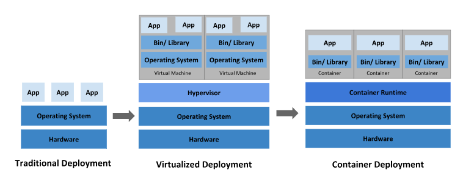

# Mentoring 

### DOCKER

- 서버를 관리하는 컨테이너가 여러개일때 관리해주는 프로그램  
  <mark>kubernetes</mark>

### 질의응답

---

부트캠프를 수료하고 바로 취업하는것이 좋을지 아니면 쪼금더 준비를 하고 취업 하면 좋을지?

- 커리어를 먼저 시작 하는것이 좋을것같다 취업하고 현업에서 배울수 있는것이 많고 내 눈높이 에서 실력을 키우는것 보다는 현업에서 사수를 두고 실력을 키우는 것이 더 도움이 될것이다.
---   
   
취업할때 연봉을 제외한 1순위가 무엇이었는지?

- 자유로운 분위기 공부하고 일하고 편한 분위기의 회사를 1순위로 정합니다.
---

신입 개발자로서 갖춰야할 마음가짐?

- 새로운것을 두려워하지말고 모든 해보는것이 중요하다. 프론트엔드, 백엔드 편식하지말고 두루두루 공부하면 무조건 좋다.
---

전공자에 비해 비전공자는 지식적으로 모자란 부분이 많은데 비전공자가 갖추면 도움이될만한 지식?

- Computer Science 지식 CS지식을 공부하면 면접에서도 도움이 될것이고 앞으로 개발자로 살아가는데도 도움이 많이됩니다.

---