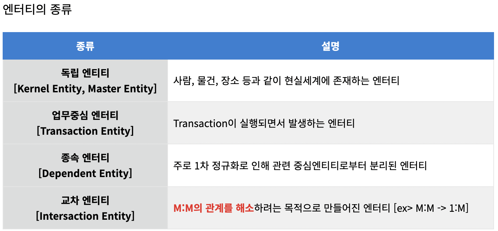

 ## 엔터티의 개념 

- 현실 세계에서 독립적으로 식별 가능한 객체나 사물을 나타냄, 테이블로정의할것이라고 생각함
  ex)학생
- 엔터티: 논리적개념
- 테이블: 물리적개념

### 엔터티의 분류

- 유형과 무형에 따른 분류
1. 유형엔터티  
   -물리적 형태가 있음(실체가 있는 대상)   
     ex:사원, 물품 등
2. 개념엔터티  
   -물리적인 형태 없음       
    ex:보험상품 등
3. 사건엔터티  
   -업무를 수행에 따라 발생하는 엔테티   
    ex:주문,청구, 미납 등

- 발생 시점에 따른 분류
1. 기본엔터티  
   -그 업무에 원래 존재하는 정보 , 독립적으로 생성, 자신의 고유한 식별자를 가짐   
    ex:사원,부서,고객
2. 중심엔터티  
   -기본엔터티로부터 발생, 많은 데이터가 발생     
     ex:계약, 청구,주문
3. 행위엔터티  
   -2개 이상의 부모엔터티로부터 발생, 내용이 바뀌거나 데이터 양이 증가  
     ex:주문(고객과 상품엔터티로 발생할 수 있기때문에 행위엔터티이기도 함)

### 엔터티의 명명

1. 협업에서 사용하는 용어로 사용
2. 약자 사용 자제
3. 단수 명사 사용
4. 모든 엔터티에서 유일하게 이름부여
5. 엔터티 생성 의미대로 이름부여

### 엔터티의 종류    
         

